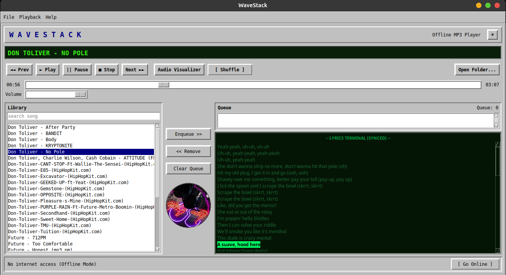

# WaveStack

A fully offline-first, 1990s-styled MP3 player for Linux desktops, built with Python, Tkinter, and libVLC.

No telemetry, no analytics, and no mandatory cloud connections. Just your local MP3 collection styled like it's 1996, featuring an opt-in hardware-style toggle to fetch synchronized lyrics only when you explicitly allow it.

## Screenshot



## Features

* **Strict retro aesthetic** thick raised/sunken borders, classic gray (`#C0C0C0`) chrome, monospace fonts, and a scrolling green LCD "now playing" marquee, all built from classic Tkinter widgets (not a themed skin, so it doesn't inherit your desktop's modern GTK/Qt look).
* **Full playback controls** Play, Pause, Stop, Next, Previous, and Mode Cycling (Normal, Shuffle, Repeat 1, Repeat All).
* **Library + Queue** browse your music folder, multi-select tracks to enqueue, remove from the queue, right-click context menus.
* **Synchronized CRT Lyrics Terminal** Displays timestamped `.lrc` lyrics in a monochrome CRT terminal format with active line tracking and click-to-seek support.
* **Opt-In Online Sync** A dedicated toggle switch defaults to `[ Offline ]`. When switched to `[ Online Sync ]`, it queries the LRCLIB API to download missing `.lrc` files for your local tracks.
* **Spinning Vinyl Animation & Visualizer** Extracts ID3 album art directly from your local audio files for a rotating vinyl disc, plus an in-app retro equalizer visualizer.
* **Working seek bar** drag to scrub through a track, powered by libVLC for reliable seeking, including on variable-bitrate MP3s.
* **Won't crash on bad input** missing/empty folders and corrupted files are handled with retro-styled dialogs, not stack traces.

## Requirements

* Ubuntu 26.04 (or any modern Linux desktop running GNOME/KDE)
* Python 3.8+
* VLC (`libvlc`) -> the audio engine
* Tkinter (`python3-tk`) -> the GUI toolkit

## Quick Start

```bash
mkdir -p ~/WaveStack && cd ~/WaveStack
# copy wavestack.py, requirements.txt, run.sh, and WaveStack.desktop here

sudo apt update && sudo apt install -y python3-venv python3-tk vlc
python3 -m venv venv
./venv/bin/pip install -r requirements.txt
chmod +x wavestack.py run.sh

mkdir -p ~/.local/share/applications
cp WaveStack.desktop ~/.local/share/applications/
update-desktop-database ~/.local/share/applications/ 2>/dev/null || true

```

WaveStack should now appear in your app launcher — search for "WaveStack". See **SETUP.md** for the same steps with an explanation of what each one does and how to undo it.

## Usage

### Playback

| Control | What it does |
| --- | --- |
| **◄◄ Prev** | Goes back to the previously played track |
| **► Play** | Starts the selected/first track, or resumes if paused |
| **|| Pause** | Pauses the current track |
| **■ Stop** | Stops and resets the position to 0:00 |
| **Next ►►** | Plays the next queued track, or the next Library track |
| **Mode Toggle** | Cycles through Normal, Shuffle, Repeat 1, Repeat All |
| **Visualizer** | Switches to the equalizer visualizer (Escape to exit) |

### Synchronized Lyrics and Online Mode

* Keep the bottom right button set to `[ Offline ]` to block all network traffic. WaveStack will only read existing `.lrc` files stored locally alongside your MP3s.
* Click `[ Offline ]` to switch to `[ Online Sync ]`. The player will read missing lyric tags in your loaded music directory, securely query LRCLIB in the background, and save `.lrc` files locally.
* **Click-to-Seek**: Click any lyric line on the CRT terminal to jump directly to that timestamp in the audio track.

### Library & Queue

* Double-click a track to play it immediately.
* Select one or more tracks (`Ctrl`/`Shift`-click) and hit **Enqueue >>** to add them to the queue.
* Right-click a track for a quick context menu (Play / Add to Queue).
* **<< Remove** takes the selected track(s) out of the queue.
* **Clear Queue** empties it entirely.

### Keyboard shortcuts

* `Ctrl+O` = Open Folder
* `Ctrl+Q` = Quit

## Configuration

WaveStack loads `.mp3` files from a hardcoded default folder on startup. Near the top of `wavestack.py`:

```python
DEFAULT_MUSIC_DIR = "/home/syed-ali-ahmed-shah/Music"

```

Change this if your username or music folder ever differs. If the folder is missing or empty, WaveStack shows a dialog offering to let you browse to the right one instead of crashing — that's intentional, not a bug.

## Project Structure

| File | Purpose |
| --- | --- |
| `wavestack.py` | The whole application: GUI, audio engine, playback logic |
| `requirements.txt` | Python dependencies (`python-vlc`, `requests`, `mutagen`, `Pillow`) |
| `WaveStack.desktop` | App launcher entry for GNOME/KDE |
| `run.sh` | Wrapper that launches `wavestack.py` with the right venv |
| `SETUP.md` | Step-by-step install commands, explained |
| `README.md` | This file |

## How It Works

* **GUI:** classic (non-`ttk`) Tkinter widgets. Unlike themed `ttk` widgets, these are rendered by Tk itself rather than your desktop's theme, so the beveled borders and chunky buttons look authentically retro everywhere, with no stylesheet fighting required.
* **Audio:** [libVLC](https://www.videolan.org/vlc/libvlc.html?utm_source=gemini) via `python-vlc`. VLC's own audio pipeline handles PipeWire/PulseAudio compatibility, reliable seeking, and format quirks far more robustly than pure-Python audio libraries.
* **Threading:** VLC fires playback events (track ended, playback error) on its own internal thread. WaveStack never touches Tkinter widgets from that thread directly — events are placed on a thread-safe queue and drained by the main window's own periodic timer instead. Network requests for lyrics are isolated to their own background thread.
* **Window chrome:** the title bar and minimize/close buttons are drawn by your window manager, not WaveStack. Ubuntu 26.04 runs Wayland-only, where custom-positioned, undecorated windows are unreliable, so everything *inside* the window is retro-styled while the outer frame stays native for compatibility.

## Troubleshooting

**"WaveStack could not start because the VLC engine is missing or broken"**
Run `sudo apt install vlc` and try again.

**"WaveStack could not start because the 'python-vlc' package is not installed"**
Run `./venv/bin/pip install -r requirements.txt` from inside `~/WaveStack`.

**App doesn't appear in the launcher after installing**
Log out and back in, or re-run `update-desktop-database ~/.local/share/applications/`. Double-check that `Exec=` in `WaveStack.desktop` points to where `run.sh` actually lives on your machine.

**No sound, but the app runs fine**
Check your system volume and default output device — WaveStack plays through whatever PipeWire/PulseAudio device is already set as default. The in-app volume slider only controls WaveStack's own output level.

## Privacy

By default, WaveStack runs **100% offline** and makes zero network requests. No analytics, no telemetry, and no background updates.

Network connections only occur if you manually toggle the bottom status button to **[ Online Sync ]**. When enabled, WaveStack queries the public LRCLIB API strictly to download missing `.lrc` synchronized lyrics for your local tracks. You can turn this off at any time to return to a fully isolated offline environment.